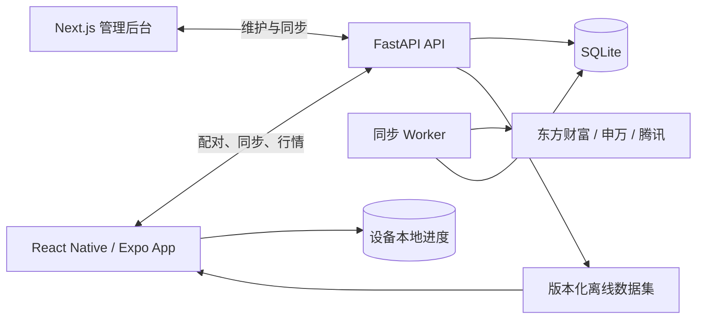

# 股识 / Gushi

用记忆卡片学习 A 股公司，以市场和板块建立长期、可恢复的股票认知。

Learn A-share companies with memory cards, organized by market and sector, with durable on-device progress.

[中文](#中文) | [English](#english) | [Wiki](docs/wiki/Home.md)

> 股识是单用户、本地优先的学习工具，不提供投资建议。公开行情仅用于学习展示，不保证交易所级实时性或完整性。

## 中文

### 核心功能

- 覆盖沪市主板、深市主板、创业板、科创板和北交所。
- 提供“股票市场”和“板块市场”两类牌组，可按市场、申万行业或东方财富概念学习。
- 支持名称识代码、代码识名称、答案揭示、记得/再学、撤销和 FSRS 间隔复习。
- 自动保存各牌组的顺序学习位置、复习进度、今日统计和连续学习天数。
- 提供类似自选股的列表浏览、搜索、收藏和详情页，展示名称、代码、价格、涨跌、板块与主营摘要。
- 手机离线保存股票数据集、收藏和学习记录；重新进入 App 后从上次位置继续。
- Web 后台支持同步、单股维护、CSV 预览导入/导出、数据集发布和局域网配对。
- 行情优先使用东方财富公开接口，失败时回退腾讯公开行情，并保留最近缓存。

### 架构



Mac 端 SQLite 是股票资料、分类和发布数据集的权威存储；CSV 只是交换格式。收藏、学习记录和断点保存在手机本地，不会被 Mac 数据库备份覆盖。

### 快速开始

前置条件：

- Docker Desktop
- Git

启动本地 API、同步 Worker 和 Web 后台：

```bash
docker compose -f infra/docker-compose.yml up --build -d
./scripts/smoke-local.sh
```

服务地址：

- Web 后台：[http://localhost:3000](http://localhost:3000)
- API 健康检查：[http://localhost:8000/health](http://localhost:8000/health)
- 持久化数据：`data/`

首次启动只创建空数据库和随机配对令牌，不会自动访问公网数据源。准备好同步全市场资料后运行：

```bash
docker compose -f infra/docker-compose.yml exec worker \
  uv run --no-sync python -m app.worker sync-all
```

公开接口可能限流或暂时不可用。同步失败不会替换最后一个可用的手机数据集。

### 移动端开发

要求 Node.js 22+。iOS 本机构建需要 macOS、完整 Xcode 和 Simulator；Android 本机构建需要 Android Studio 或可用设备。

```bash
npm install
npm --workspace @gushi/mobile run start
```

也可以直接启动指定平台：

```bash
npm --workspace @gushi/mobile run ios
npm --workspace @gushi/mobile run android
```

在 App“设置”中填写 Mac 的局域网 API 地址，例如 `http://<Mac局域网IP>:8000`，并使用后台“设置”页显示的配对令牌。不要把令牌提交到 Git、放入 CSV 或发送到公网服务。

### 测试与验收

```bash
make test
./scripts/verify-all.sh
```

`verify-all.sh` 使用隔离的临时数据库和确定性五市场样例，执行 API、后台、移动端、类型检查、生产构建、Docker 冒烟、Playwright E2E 和 Android 导出。iOS 断点流程只有在完整 Xcode、已启动 Simulator、Maestro 和已安装 App 同时可用时才执行。

### 文档

- [Wiki 首页](docs/wiki/Home.md)
- [快速开始](docs/wiki/Getting-Started.md)
- [系统架构](docs/wiki/Architecture.md)
- [数据与同步](docs/wiki/Data-and-Sync.md)
- [移动端](docs/wiki/Mobile-App.md)
- [运维](docs/wiki/Operations.md)
- [测试与故障排查](docs/wiki/Testing-and-Troubleshooting.md)
- [详细本地运维手册](docs/operations.md)

### 数据与免责声明

股票范围、公司资料、概念和主要行情来自东方财富公开接口；申万分类来自申万公开接口；行情失败时使用腾讯公开接口回退。数据源可能调整、限流、延迟或返回不完整数据。股识仅用于记忆学习，不构成证券研究、交易信号或投资建议。

## English

### Core Features

- Covers the Shanghai Main Board, Shenzhen Main Board, ChiNext, STAR Market, and Beijing Stock Exchange.
- Provides two deck families, Markets and Sectors, with market, Shenwan industry, and Eastmoney concept decks.
- Supports name-to-symbol and symbol-to-name prompts, answer reveal, remembered/again ratings, undo, and FSRS spaced review.
- Persists sequential checkpoints, review progress, daily statistics, and study streaks independently for each deck.
- Includes watchlist-style browsing, search, favorites, and detail views for name, symbol, quote, sector, and business summary.
- Stores the stock dataset, favorites, and study history offline on the device and resumes from the previous position.
- Provides a Web admin for synchronization, per-stock maintenance, CSV preview/import/export, dataset publication, and LAN pairing.
- Uses Eastmoney public quotes first, falls back to Tencent public quotes, and retains the latest cached value.

### Architecture

The React Native app synchronizes versioned offline datasets from the FastAPI service and keeps user learning state on the device. The Next.js admin and synchronization worker share a local SQLite data store with the API. See the [architecture guide](docs/wiki/Architecture.md) for component and data-flow details.

### Quick Start

Prerequisites:

- Docker Desktop
- Git

Start the local API, synchronization worker, and Web admin:

```bash
docker compose -f infra/docker-compose.yml up --build -d
./scripts/smoke-local.sh
```

Local endpoints:

- Web admin: [http://localhost:3000](http://localhost:3000)
- API health: [http://localhost:8000/health](http://localhost:8000/health)
- Persistent data: `data/`

The first start creates an empty database and a random pairing token without contacting public data sources. Run the first full synchronization explicitly:

```bash
docker compose -f infra/docker-compose.yml exec worker \
  uv run --no-sync python -m app.worker sync-all
```

Public endpoints may throttle requests or become temporarily unavailable. A failed synchronization does not replace the last usable mobile dataset.

### Mobile Development

Node.js 22+ is required. Native iOS development requires macOS, full Xcode, and Simulator. Native Android development requires Android Studio or a compatible device.

```bash
npm install
npm --workspace @gushi/mobile run start
```

Platform-specific entry points:

```bash
npm --workspace @gushi/mobile run ios
npm --workspace @gushi/mobile run android
```

In the app settings, enter the Mac LAN API URL, such as `http://<Mac-LAN-IP>:8000`, and the pairing token shown on the admin Settings page. Never commit the token, place it in CSV, or send it to a public service.

### Testing

```bash
make test
./scripts/verify-all.sh
```

`verify-all.sh` uses an isolated temporary database and deterministic fixtures for all five markets. It runs API, admin, and mobile tests; type checks; the production build; Docker smoke checks; Playwright E2E; and an Android export. The iOS resume flow runs only when full Xcode, a booted Simulator, Maestro, and an installed app are available.

### Documentation

- [Wiki home](docs/wiki/Home.md)
- [Getting started](docs/wiki/Getting-Started.md)
- [Architecture](docs/wiki/Architecture.md)
- [Data and synchronization](docs/wiki/Data-and-Sync.md)
- [Mobile app](docs/wiki/Mobile-App.md)
- [Operations](docs/wiki/Operations.md)
- [Testing and troubleshooting](docs/wiki/Testing-and-Troubleshooting.md)
- [Detailed local operations runbook](docs/operations.md)

### Data and Disclaimer

The stock universe, company profiles, concepts, and primary quotes use public Eastmoney endpoints. Shenwan classification uses a public Shenwan endpoint, and Tencent is the quote fallback. Sources can change, throttle, lag, or return incomplete data. Gushi is a memory-learning tool, not securities research, a trading signal, or investment advice.
