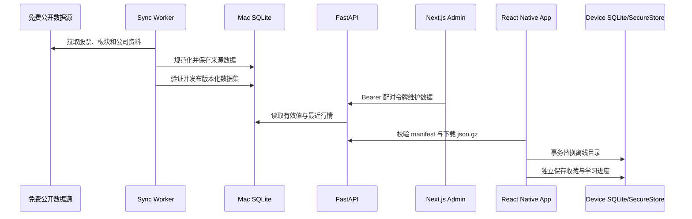

# 系统架构 / Architecture

[首页](Home.md) | [快速开始](Getting-Started.md) | [Web 后台](Web-Admin.md) | [数据与同步](Data-and-Sync.md) | [移动端](Mobile-App.md) | [运维](Operations.md) | [测试与排障](Testing-and-Troubleshooting.md) | [项目状态](Project-Status.md)

## 中文

### 组件职责

| 组件 | 技术 | 职责 |
| --- | --- | --- |
| Mobile App | React Native、Expo Router、Expo SQLite | 浏览、收藏、卡片学习、离线数据、学习断点 |
| Web Admin | Next.js | 同步控制、股票维护、CSV、数据集发布、配对信息 |
| API | FastAPI | 认证目录、股票、行情、同步与管理接口 |
| Worker | APScheduler、Python | 定时/手工同步、公司资料更新、数据集发布 |
| Server Store | SQLite、SQLAlchemy | 股票、板块、来源值、人工覆盖、同步记录、行情与发布版本 |
| Contracts | TypeScript | 后台与移动端共享的 API 类型和客户端 |

### 数据流

### 数据所有权

- Mac SQLite 是股票、板块、公司资料、人工覆盖、最近行情和数据集版本的权威存储。
- `data/raw/` 保存上游原始响应的压缩快照，便于追溯解析问题。
- `data/datasets/` 保存经过验证、按内容哈希版本化的 `json.gz` 手机数据集。
- 手机 SQLite 保存下载后的目录、最近行情、收藏、FSRS 状态、学习事件和牌组断点。
- 配对令牌在 Mac 使用权限为 `0600` 的文件保存，在手机使用 SecureStore 保存。

### API 与认证

`/health` 用于无认证健康检查。`/api/v1` 下的目录、股票、行情、同步和维护接口要求 `Authorization: Bearer <pairing-token>`。后台在服务器端读取令牌并代理请求，浏览器页面不需要持有令牌文件。

### 故障边界

- 同步先写数据库，再验证并原子替换发布文件；失败不会覆盖最后一个可用数据集。
- 行情主源失败时尝试腾讯回退；两者都失败时客户端可继续展示最近缓存并标注新鲜度。
- 手机应用数据集时使用事务，校验版本、数量、哈希和引用关系后才替换本地目录。
- 学习进度与数据集目录分表保存，更新股票资料不会清空用户学习记录。

## English

### Component Responsibilities

| Component | Technology | Responsibility |
| --- | --- | --- |
| Mobile App | React Native, Expo Router, Expo SQLite | Browsing, favorites, cards, offline data, and study checkpoints |
| Web Admin | Next.js | Sync controls, stock maintenance, CSV, publication, and pairing information |
| API | FastAPI | Authenticated catalog, stock, quote, synchronization, and admin APIs |
| Worker | APScheduler, Python | Scheduled/manual synchronization, profile refresh, and publication |
| Server Store | SQLite, SQLAlchemy | Stocks, sectors, source values, overrides, sync runs, quotes, and releases |
| Contracts | TypeScript | Shared API types and clients for admin and mobile |

### Ownership and Flow

Mac SQLite is authoritative for reference data and releases. Raw upstream payloads and published compressed datasets remain under `data/`. The mobile database owns its downloaded catalog, quotes, favorites, FSRS state, study events, and deck checkpoints. The pairing token is stored in a mode-`0600` file on the Mac and in SecureStore on the phone.

All `/api/v1` business endpoints require the pairing Bearer token; `/health` does not. The admin reads the token server-side and proxies API requests.

### Failure Boundaries

- Publication validates data and atomically replaces a versioned file, preserving the previous usable release on failure.
- Quote requests fall back from Eastmoney to Tencent, then retain the last cached value when both are unavailable.
- Mobile dataset replacement is transactional and validates the version, checksum, counts, and references first.
- Catalog replacement does not delete device-local favorites or learning history.
